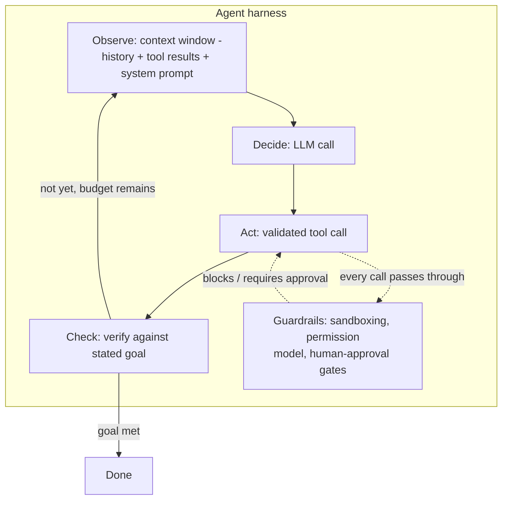

## What it is & the core abstraction

An LLM that can call functions is not an agent you'd trust unattended — it's a single
augmented inference step. The **harness** is everything wrapped around that step that
turns it into a system you can point at a real task and walk away from: the loop that
re-invokes the model, the tools it's allowed to call, the context it's fed on each turn,
and the checks that decide whether to keep going, stop, or escalate to a human.

The one abstraction that makes everything else make sense: **the harness owns the loop;
the model only owns the decision inside one turn of it.** The model never has more
control than "given this context, propose the next action." Everything about *whether*
that action is safe to run, *what* context it sees, *how long* the loop is allowed to
run, and *whether the outcome actually satisfied the goal* is harness logic, not model
behavior. Anthropic's own framing draws the same line at the building-block level: an
"augmented LLM" (retrieval + tools + memory) is the unit; a harness composes many of
those units into workflows (predictable, code-defined paths) or agents (the model
directs its own steps) depending on how much the task's structure is known up front.

Minimal shape of the loop:

```
loop:
  observe   (context: history + tool results, budgeted — Track A/CE)
  decide    (LLM call: plan next action or tool call)
  act       (validated tool call, or a reflection step)
  check     (did the action's output satisfy the stated goal? — Track L)
until goal met, budget exhausted, or a guardrail trips
```

## Architecture diagram



Two things separate a toy loop from a production harness, per Anthropic's own
production notes on long-running coding agents: (1) **validation + retry on typed
output** — a malformed tool call gets rejected and retried rather than cascading into
garbage state, and (2) a **target-plus-evidence habit** — the agent doesn't just act, it
proves the action worked (tests pass, the page renders, the diff compiles) before
claiming the step done. Agents that skip step (2) reliably fail by declaring victory
early or leaving undocumented half-finished code behind.

## Industry use cases

- **Claude Agent SDK / Claude Code** — Anthropic describes the SDK as "a powerful,
  general-purpose agent harness" built around a permission model, a hooks system, and
  context-compaction across sessions so a coding agent can keep working after a single
  context window fills up. Their internal long-running-agent research settled on a
  **two-agent pattern**: an *initializer* agent (first session) writes a structured
  feature list, an `init.sh` boot script, and an initial commit; a *coding* agent
  (every later session) reads the progress log and git history, works one feature at a
  time, and runs end-to-end verification before committing — deliberately mimicking
  what a human engineer does at the start and middle of a workday.
- **SWE-bench agent tool design** — in the same "Building Effective Agents" writeup,
  Anthropic reports spending more optimization effort on the **agent-computer
  interface** (tool documentation, absolute paths, low-JSON-escaping-overhead formats,
  worked examples) than on the surrounding prompt — treating tool design as its own
  discipline, on par with human-computer interface design.
- **Harness-engineering ecosystem** — the broader pattern (tools, memory, MCP wiring,
  permissions, observability) is consolidated as "harness engineering" across
  frameworks like LangGraph, CrewAI, and the OpenAI Agents SDK, all of which converge on
  the same shape: a loop, a typed tool boundary, and an explicit stop/escalate
  condition, even though each framework packages it differently.

## Exceptions / failure modes

- **Compounding errors under full autonomy** — because the harness lets the model
  choose its own next action, an early wrong turn (misreading a file, misdiagnosing a
  bug) can cascade for many turns before a check catches it. Anthropic's guidance is
  explicit: agents need extensive sandboxed testing and human checkpoints before
  irreversible actions (payments, deletions, destructive schema changes) *precisely
  because* automated checks can't verify every requirement a human would catch.
- **Context exhaustion without compaction is not enough on its own** — a harness that
  only compacts history when the window fills up still degrades on quality before it
  hits the hard token ceiling ("context rot" / lost-in-the-middle effects — see
  `context-window-budgeting`). Compaction prevents overflow; it doesn't by itself
  prevent the earlier quality drop.
- **Premature "done" declarations** — the most common production failure Anthropic
  reports isn't a crash, it's an agent asserting a task is complete without evidence.
  The fix is structural (a mandatory verification step in the loop), not a prompt
  instruction — telling the model "please verify" is much weaker than a harness that
  refuses to advance the loop state until a check actually runs.
- **Over-scoped single-agent tasks** — agents that try to do too much in one pass (build
  the whole feature set in one session) fail more often than ones scoped to one
  feature per loop iteration; the harness's job is to enforce that scoping, not to hope
  the model self-limits.

## Sources

- [Anthropic — Building Effective AI Agents](https://www.anthropic.com/research/building-effective-agents) — workflows vs. agents, augmented LLM, agent-computer interface design.
- [Anthropic — Effective Harnesses for Long-Running Agents](https://www.anthropic.com/engineering/effective-harnesses-for-long-running-agents) — Claude Agent SDK as a harness, the initializer/coding two-agent production pattern.
- [Anthropic — Effective Context Engineering for AI Agents](https://www.anthropic.com/engineering/effective-context-engineering-for-ai-agents) — context rot, compaction, and why harnesses must budget attention, not just tokens.
- [GitHub — awesome-harness-engineering](https://github.com/ai-boost/awesome-harness-engineering) — survey of the broader harness-engineering ecosystem (tools, memory, MCP, permissions, observability).
