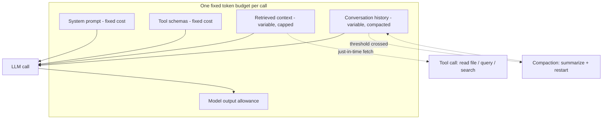
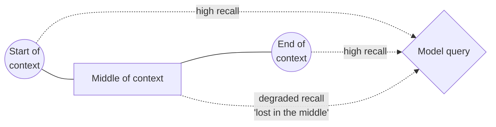

## What it is & the core abstraction

Every model call shares one fixed pool of tokens across everything that has to be in
context: the system prompt, tool schemas, retrieved chunks, conversation history, and
the model's own output allowance. The core abstraction is that this pool is not just a
**size limit** — it's an **attention budget**. Anthropic's framing: because transformer
attention is pairwise across every token in context, quality degrades continuously as
context grows ("context rot"), well before you hit the hard token ceiling. Treating the
context window like a bag you throw everything into — instead of a budget you spend
deliberately — is the mistake this concept exists to prevent.

That reframes the design problem from "does it fit?" to "is this the highest-value
configuration of tokens I can put in front of the model right now?" — the same budget
can be spent on a bloated tool catalog and stale history, or on exactly the facts the
model needs for this turn, and the latter performs measurably better even at identical
token count.

Split the budget into what's fixed vs. what you actively manage:

- **Fixed costs, paid every call** — system prompt and tool schemas. Anthropic's advice
  is to keep the system prompt in a "Goldilocks zone": specific enough to steer
  behavior, not so exhaustive it turns brittle; and to keep the tool set small and
  non-overlapping, since redundant tools burn budget *and* actively degrade the model's
  tool-choice quality.
- **Variable costs, actively managed** — retrieved context (Track CE) and conversation
  history. Left unmanaged these grow every turn and silently crowd out the model's
  output allowance. The fix is "just-in-time" retrieval: keep lightweight references
  (file paths, IDs, URLs) in context and fetch full content only when a tool call needs
  it, rather than pre-loading everything up front.
- **Degradation before overflow** — "lost in the middle" (Liu et al.) showed models
  retrieve information at the start or end of a long context far more reliably than
  information buried in the middle; a budget that technically fits can still perform
  badly if the highest-priority facts land in the dead zone.

## Architecture diagram

## Industry use cases

- **Claude Code's hybrid retrieval** — Anthropic's own coding agent loads a small,
  curated `CLAUDE.md` up front (fixed cost, high-value) and leaves the rest of the
  codebase to just-in-time `grep`/`glob` tool calls, rather than pre-loading source
  files into context — a direct application of the fixed-vs-variable split.
- **Long-horizon agent memory (Claude playing Pokémon)** — Anthropic's internal
  long-running-agent work maintained coherence across thousands of steps by writing
  structured notes (precise tallies, decisions) to external memory and reading them
  back in, instead of letting raw history accumulate — because unmanaged history both
  overflows the budget and rots in quality before it does.
- **Context editing / prompt caching in production agent loops** — Anthropic's context
  editing feature automatically clears stale tool results once input crosses a
  threshold, replacing them with placeholders; combined with a memory tool, Anthropic
  reports this improved agent search-task performance by 39% and cut token consumption
  by 84% over a 100-round web-search benchmark — a concrete measurement of budgeting
  paying off, not just a theoretical concern.

## Exceptions / failure modes

- **Compaction without judgment loses architectural decisions** — naive summarization
  can discard the *reason* a decision was made along with the redundant tool output
  that surrounded it. Anthropic's guidance is to compact in a way that explicitly
  preserves decisions and open threads, not just to shrink token count.
- **A budget that "fits" can still fail silently** — because degradation is continuous
  (context rot) rather than a hard cliff, a call that's well under the token ceiling can
  still underperform if the highest-priority instruction is buried mid-context. There's
  no error to catch here; it just quietly answers worse.
- **Over-eager just-in-time retrieval adds latency and tool-call overhead** — deferring
  everything to runtime fetches trades a context-budget problem for a
  latency/tool-call-count problem; the right split depends on how predictable the
  needed context is, not a universal rule.
- **Redundant tool schemas are a hidden fixed-cost tax** — since tool schemas are paid
  on every single call regardless of whether the tool is used that turn, an overgrown
  or overlapping tool catalog is one of the most common sources of wasted budget, and
  it also confuses tool selection, doubling the damage.

## Sources

- [Anthropic — Effective Context Engineering for AI Agents](https://www.anthropic.com/engineering/effective-context-engineering-for-ai-agents) — attention budget / context rot framing, compaction, just-in-time retrieval, production numbers.
- [Liu et al. — Lost in the Middle: How Language Models Use Long Contexts (TACL 2024)](https://aclanthology.org/2024.tacl-1.9/) — the primary empirical source for positional degradation in long contexts.
- [Anthropic — Context Editing (Claude Platform Docs)](https://platform.claude.com/docs/en/build-with-claude/context-editing) — official mechanics of server-side context editing: trigger thresholds, what gets cleared, and interaction with prompt-cache prefixes.
