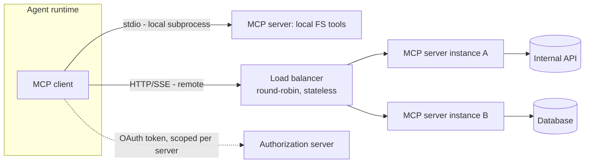
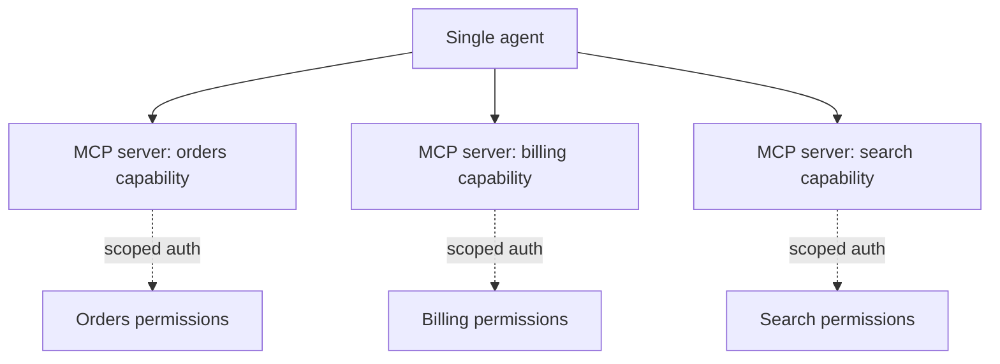

## What it is & the core abstraction

MCP (Model Context Protocol) standardizes agent↔tool wiring the same way HTTP
standardized browser↔server wiring: a **server** exposes a bounded set of tools (and
optionally resources/prompts) over a defined transport; a **client** — the agent's
runtime — discovers what's available and calls it with typed, validated requests. The
one abstraction that makes topology decisions fall out naturally: **MCP defines the
contract between agent and tool, not the contract between agent and agent** — every
question about "how many servers, where do they run, how do we scope auth" is really a
question of "how do we draw the boundary around one bounded capability," because the
protocol itself only cares about client↔server, not about coordinating multiple agents.

As of the 2026-07-28 spec, that contract got simpler at the transport layer: MCP moved
from a stateful protocol (an `initialize`/`initialized` handshake that pinned a client
to one server instance via an `Mcp-Session-Id`) to a **stateless protocol core**, where
client metadata travels in `_meta` fields on every request instead of being negotiated
once. That single change is what lets a remote MCP server run behind a plain
round-robin load balancer instead of needing sticky routing and a shared session
store — the topology story got dramatically simpler because the protocol stopped
requiring server affinity.

```
[Agent runtime] --(MCP client)--> [MCP server] --> [your actual tool/API/DB]
                    ^ discovery + typed call + auth (OAuth/RBAC)
```

## Architecture diagram





Design points that follow directly from the "bounded capability" abstraction:

- **One server per bounded capability** — don't build one monolithic MCP server for
  everything; a cohesive server per real capability means auth, rate limits, and
  permissions can be scoped per server rather than as one blast-radius-everything grant.
- **Auth is not optional in production** — OAuth/RBAC on the server means a compromised
  or misbehaving agent can't silently escalate beyond its granted scope. The 2026-07-28
  spec hardens this further: clients must validate the `iss` parameter (RFC 9207), bind
  credentials to a specific authorization server, and declare an OpenID Connect
  `application_type` at registration.
- **A2A is a different layer** — agent-to-agent (A2A) protocols coordinate multiple
  agents; MCP connects one agent to tools. They're complementary, not competing — a
  multi-agent system may use both simultaneously, with MCP inside each agent's tool
  boundary and A2A between agents.
- **Stateless doesn't mean stateless application logic** — servers can still maintain
  application state, but it has to be explicit: threading a handle like `basket_id`
  between calls so state is visible to the model, instead of hidden in transport-layer
  session metadata the way it was pre-2026.

## Industry use cases

- **Cloudflare's enterprise reference architecture** — Cloudflare deploys MCP servers
  remotely on its own developer platform, fronts them with Cloudflare Access for
  SSO/MFA/device-posture-aware authorization, and adds an **MCP server portal** so
  employees can discover every internal and third-party MCP server they're authorized
  to use, with centralized logging and DLP guardrails. This is the "one server per
  bounded capability, centrally governed" topology at enterprise scale.
- **Remote MCP servers as Cloudflare Workers** — Cloudflare's own developer docs walk
  through deploying an MCP server as a Workers-hosted remote endpoint rather than a
  local stdio subprocess, which is the shift the stateless spec change was designed to
  support: horizontally scaled, load-balanced MCP servers behind standard HTTP infra
  instead of one pinned long-lived process per client.
- **Local stdio for developer tools, remote HTTP for shared/team tools** — the two
  transports map to two different topologies in practice: stdio subprocess servers for
  single-user local tools (file systems, local git), and remote HTTP/SSE servers for
  anything shared across a team or exposed to multiple agent clients — Cloudflare's
  "13 new MCP servers" release and the broader Cloudflare MCP ecosystem push are both
  built on the remote-HTTP side of that split.

## Exceptions / failure modes

- **Monolithic "do everything" servers defeat the auth model** — a single MCP server
  wrapping ten unrelated capabilities means one OAuth grant covers all ten; a
  compromised or over-permissioned client escalates across all of them at once. This is
  a design failure, not a protocol limitation — the protocol supports fine-grained
  servers, but nothing forces you to build them that way.
- **Migrating across the 2026-07-28 breaking change is not optional forever** — servers
  and clients built against the pre-stateless spec (`2025-11-25`) relying on
  `Mcp-Session-Id` and the `initialize` handshake need explicit migration: drop session
  init flows, move any experimental Tasks usage to the new extension lifecycle, and
  update error-code handling (resource errors moved from `-32002` to `-32602`). Anything
  still assuming server affinity after the ten-week validation window closes will break
  against round-robin-balanced deployments.
- **Unauthorized/shadow remote MCP servers are a real enterprise exposure** — Cloudflare's
  own writeup frames "detecting unauthorized remote MCP servers on the network" as a
  first-class problem, not a hypothetical: without a discovery/governance layer, an
  employee's agent can end up talking to a server nobody vetted for data-loss exposure.
- **stdio-only servers don't horizontally scale** — a local-subprocess-per-client
  topology is fine for single-user tools but doesn't survive being shared across many
  concurrent agent sessions; that's specifically the gap the stateless HTTP transport
  and load-balancer-friendly design were built to close.

## Sources

- [Model Context Protocol Blog — The 2026-07-28 MCP Specification Release Candidate](https://blog.modelcontextprotocol.io/posts/2026-07-28-release-candidate/) — primary source for the stateless protocol core, transport/topology implications, and the breaking changes.
- [Model Context Protocol Blog — The 2026 MCP Roadmap](https://blog.modelcontextprotocol.io/posts/2026-mcp-roadmap/) — broader spec direction (Extensions, Tasks, Server Cards, auth hardening) for context on where the protocol is headed.
- [Cloudflare — Scaling MCP Adoption: Reference Architecture for Enterprise Deployments](https://blog.cloudflare.com/enterprise-mcp/) — production topology: remote servers, centralized governance, server portal, DLP.
- [Cloudflare Developers — Build a Remote MCP Server](https://developers.cloudflare.com/agents/guides/remote-mcp-server/) — primary walkthrough of the remote/HTTP deployment shape in practice.
