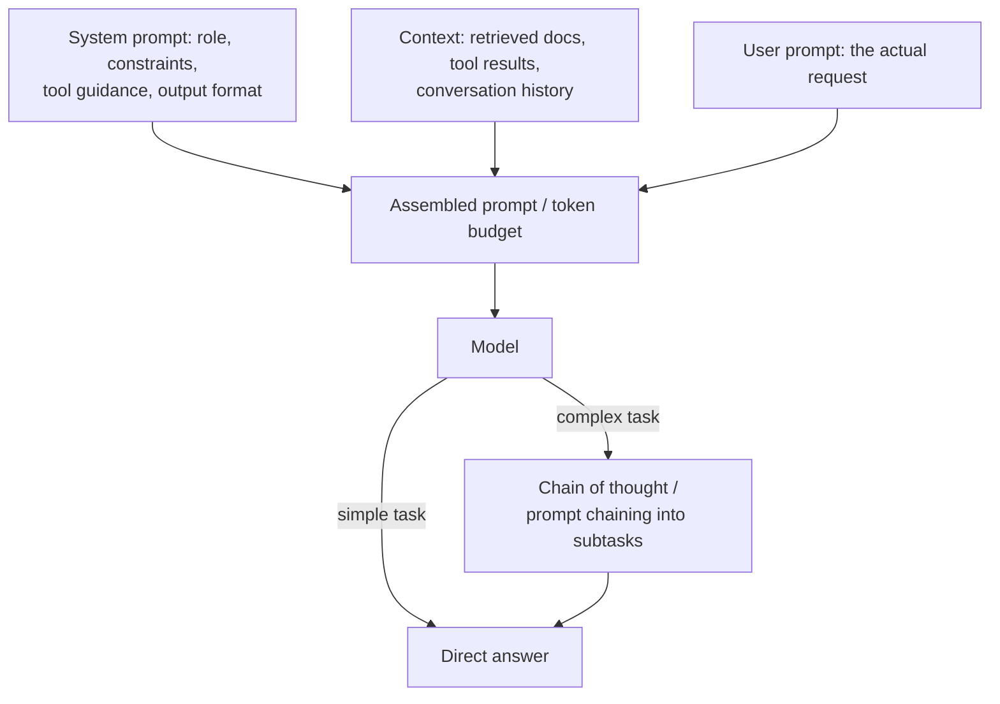

## What it is & the core abstraction

Prompt engineering is choosing the tokens the model sees so as to maximize the odds of
the output you want, given a fixed model and a fixed task. Anthropic's engineering
guidance reframes this precisely: the real unit of control isn't "the prompt" as one
blob of text, it's the **whole token budget** the model attends over — system prompt,
tool definitions, retrieved context, and conversation history all compete for the same
finite attention. The core discipline, in Anthropic's words, is finding "the smallest
possible set of high-signal tokens that maximize the likelihood of some desired
outcome" — not writing more instructions, writing the *right* ones, at the right
altitude: specific enough to constrain behavior, not so specific it becomes a brittle
list of hardcoded edge cases the model can't generalize from.

OpenAI's guidance converges on the same practical strategies from the other direction:
write clear, explicit instructions; provide reference text/context instead of assuming
the model knows your specifics; split complex tasks into smaller subtasks (prompt
chaining); give the model room to reason before answering; and treat the whole thing as
iterative — write a draft, test against real cases, revise.

## Structure and technique

- **Structured sections, not one paragraph** — Anthropic recommends organizing prompts
  into explicit, labeled sections (XML tags like `<background_information>`,
  `<instructions>`, or Markdown headers) so the model — and the engineer debugging it —
  can tell which part of the prompt is doing which job.
- **Examples over abstract instruction ("multishot")** — a few concrete input/output
  examples usually pin down a desired format or tone more reliably than a paragraph
  describing it abstractly, especially for output-format-sensitive tasks.
- **Chain of thought / prompt chaining** — for tasks with real reasoning steps, letting
  the model think before answering (or splitting one large task into a chain of smaller
  prompts, per OpenAI's guidance) improves accuracy — but for simple, well-specified
  tasks it's pure latency/cost overhead with no accuracy gain, so it's not a default to
  reach for everywhere.
- **System-prompt vs. user-prompt boundary** — the system prompt is where role,
  constraints, and tool-use guidance live because it's the part the application author
  controls; the user/tool-result channel is where untrusted content flows in. That
  boundary is a security boundary as much as an organizational one (see below).

## Industry use cases

- **Anthropic's own agent-harness guidance** — Anthropic's engineering blog documents
  moving from "prompt engineering" framing to "context engineering" specifically
  because production agents kept failing from **context rot**: as the token count grew
  (long tool histories, bloated tool definitions), recall and instruction-following
  degraded, not because the instructions were wrong but because there were too many
  competing, low-signal tokens for the model to weight correctly.
- **OpenAI's API guidance for production integrations** — OpenAI's official best
  practices (used across products built on the OpenAI API) center on systematic,
  test-driven prompt iteration: write an initial prompt, run it against real cases,
  inspect failures, revise — the same empirical loop this repo's own enrichment
  workflow (`pnpm test && pnpm build` as the regression gate) mirrors for prompt
  changes in a codebase.
- **Slack AI (PromptArmor disclosure, August 2024)** — a documented real-world case
  where researchers showed Slack AI's RAG feature would ingest a malicious instruction
  posted in a public channel, retrieve it into a victim's query context, and follow it —
  exfiltrating private-channel data (including API keys) via a crafted Markdown link,
  because the model can't distinguish the developer's system prompt from attacker-
  controlled content that retrieval pulled into the same context window. Slack patched
  it after responsible disclosure. This is the concrete case for why the system/user
  prompt boundary is a security boundary, not just an organizational one.

## Exceptions / failure modes

- **Prompt injection (direct and indirect)** — per OWASP's LLM01:2025 classification, a
  *direct* injection is a user directly overriding intended behavior through their own
  input; an *indirect* injection is malicious instructions hidden in external content
  the model reads (a retrieved doc, a web page, a tool result) that the model can't
  distinguish from the developer's own instructions, because LLMs don't natively
  segregate "instructions" from "data" in the token stream. OWASP's recommended
  mitigations are layered, not a single fix: constrain behavior via the system prompt,
  validate output deterministically, filter inputs/outputs, enforce least-privilege on
  what the model's tools can actually do, and require human approval before
  high-stakes actions — because no single layer is foolproof.
- **Context rot** — beyond a certain token count, adding more context degrades
  performance rather than improving it; more tool definitions or longer history isn't
  free, it's actively competing for the same attention budget as the instructions that
  matter.
- **Over-specification / edge-case laundry lists** — stuffing every edge case you've
  ever seen into the prompt, instead of a few canonical examples, tends to make prompts
  brittle rather than robust: the model pattern-matches to the literal cases given and
  generalizes worse to new ones.
- **Chain-of-thought isn't free accuracy** — added reasoning steps cost latency and
  tokens on every call; for tasks that don't actually require multi-step reasoning it's
  pure overhead, and can occasionally hurt output quality if the "thinking" wanders.
- **No foolproof prevention** — OWASP is explicit that because generative models are
  stochastic and don't cleanly separate instructions from data, none of the known
  mitigations for prompt injection is a complete guarantee; the practical stance is
  defense in depth plus keeping irreversible actions behind a human or a hard permission
  check, not behind prompt wording alone.

## Sources

- [Anthropic — Prompt engineering overview](https://platform.claude.com/docs/en/docs/build-with-claude/prompt-engineering/overview) — Claude's prompting techniques index (clarity, examples, XML structuring, role prompting, chain of thought, prompt chaining).
- [Anthropic — Effective context engineering for AI agents](https://www.anthropic.com/engineering/effective-context-engineering-for-ai-agents) — the "altitude," token-budget, and context-rot framing used above.
- [OpenAI — Best practices for prompt engineering with the OpenAI API](https://help.openai.com/en/articles/6654000-best-practices-for-prompt-engineering-with-the-openai-api) — clear instructions, reference text, task splitting, iterative testing.
- [OWASP GenAI Security — LLM01:2025 Prompt Injection](https://genai.owasp.org/llmrisk/llm01-prompt-injection/) — direct vs. indirect injection definitions and layered mitigation guidance.
