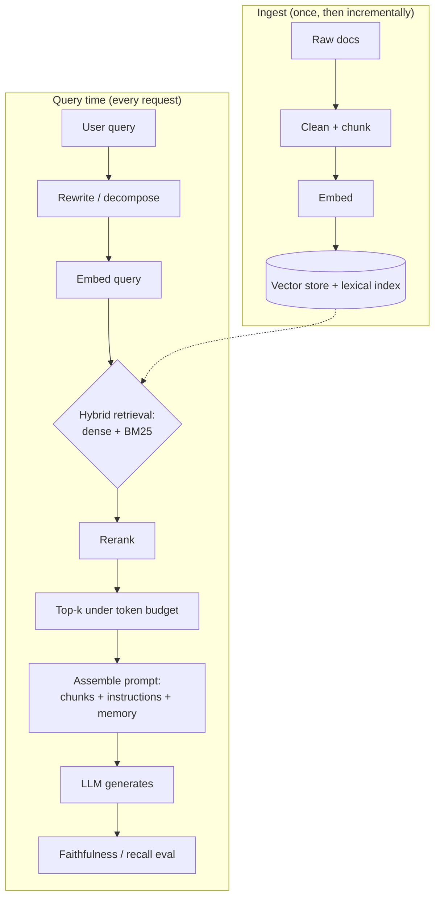

## What it is & the core abstraction

RAG's one abstraction: an LLM's knowledge is frozen at training time and bounded by its
context window, so instead of asking it to *remember* your corpus, you give it a
**retriever** that fetches the relevant slice of that corpus at query time and hands it
to the model as prompt context. The model never "knows" your docs — it reads the ones
the retriever put in front of it, every single call. That reframes almost every RAG bug
as a retrieval-quality bug, not a model bug: if the right chunk never reaches the prompt,
no amount of clever generation recovers it.

Per AWS's framing, the process is one setup step done once, then three steps repeated
per query:

1. **Ingest once** — clean and chunk the corpus, embed each chunk, write it to a vector
   store (an index over embeddings, sometimes paired with a lexical/BM25 index).
2. **Retrieve per query** — embed the incoming query, run similarity search (and/or
   lexical search) against the store, get back candidate chunks.
3. **Rerank / assemble** — score and filter candidates against a token budget, assemble
   the survivors plus instructions into the final prompt.
4. **Generate** — the model answers from the assembled context, ideally citing which
   chunk it used.

## Architecture diagram

The retrieval side is the part that determines whether generation can succeed at all —
Perplexity's production search stack (built on Vespa) runs query intent parsing, hybrid
dense+lexical retrieval, and a multi-stage reranker before a single token of generation
happens, precisely because a document that never clears reranking can't be cited no
matter how good the model is.

## Industry use cases

- **Perplexity (consumer AI search)** — retrieval is a first-class, mandatory step, not
  an add-on: real-time web crawling feeds a hybrid BM25 + dense-embedding index in
  Vespa, a multi-layer (L1-L3) reranker filters candidates down to citation-worthy
  passages, and generation is explicitly constrained to synthesize only from what
  survived reranking — including a fail-safe that discards weak results and re-queries
  rather than answering from thin evidence.
- **Glean (enterprise search / RAG assistant)** — rather than one generic embedding
  model, Glean continues pretraining BERT-based embeddings per customer on that
  company's own corpus and jargon, generates training signal from title/body pairs,
  co-access patterns, and real search/RAG feedback, and explicitly keeps traditional
  exact-match and recency search alongside semantic retrieval because, in their
  experience, classic search alone still resolves 60-70% of real enterprise queries.
- **AWS Bedrock / enterprise knowledge-base RAG** — AWS's reference architecture treats
  RAG as a full production system, not just embed-and-search: connectors per data
  source, a dedicated data-processing stage for messy formats (PDFs, scans, SharePoint),
  guardrails on the retrieved context and the response, and an orchestrator that ties
  ingestion, retrieval, and generation into one managed workflow.

## Exceptions / failure modes

- **Retrieval miss, not generation failure** — most production RAG failures happen
  because the right chunk was never surfaced (poor chunking, an embedding model that
  doesn't understand domain vocabulary, or a query/document vocabulary gap) rather than
  because the model reasoned badly over the right context. Debug retrieval first.
- **Lost in the middle** — models attend most strongly to the start and end of a
  context window and under-weight the middle. Dumping ten "relevant" chunks in
  arbitrary order buries the best one; reranking to place the highest-relevance chunks
  at the edges of the assembled context measurably helps.
- **Chunking artifacts** — fixed-size chunking that ignores document structure splits a
  sentence, table row, or list across chunk boundaries, so neither half is retrievable
  on its own. Recursive or semantic (structure-aware) chunking mitigates this at the
  cost of pipeline complexity.
- **Confident hallucination from irrelevant-but-plausible context** — when the retriever
  returns chunks that are superficially on-topic but don't actually contain the answer,
  the model will often synthesize a fluent, wrong answer from them rather than declining
  — reranking and stricter relevance thresholds reduce this, they don't eliminate it.
- **Stale index** — the corpus changes but the index doesn't get re-embedded, so
  retrieval confidently returns superseded information. Production systems need a
  live/incremental indexing pipeline, and — per Glean's experience — a way to score
  *authoritativeness* (which of several similar documents supersedes the others), which
  is a harder problem than freshness alone.
- **Prompt injection via retrieved content** — retrieved chunks are, from the model's
  point of view, just more text in the context window. Per OWASP's LLM01 classification,
  instructions hidden in a retrieved document are an *indirect* prompt injection vector:
  content pulled in by the retriever can attempt to override the system prompt exactly
  as an untrusted tool result can. Mitigation is the same as any untrusted-content
  boundary: mark retrieved text as data, not instructions, and keep privileged actions
  gated behind least-privilege access and human approval, not model judgment.

## Sources

- [AWS Prescriptive Guidance — Understanding Retrieval Augmented Generation](https://docs.aws.amazon.com/prescriptive-guidance/latest/retrieval-augmented-generation-options/what-is-rag.html) — the four-step RAG process and the production-system component list (connectors, guardrails, orchestrator).
- [Vespa Blog — How Perplexity beat Google on AI Search](https://blog.vespa.ai/perplexity-show-what-great-rag-takes/) — Perplexity's hybrid retrieval + layered reranking architecture in production.
- [Jason Liu — Fine-Tuning Embedding Models for Enterprise RAG: Lessons from Glean](https://jxnl.co/writing/2025/03/06/fine-tuning-embedding-models-for-enterprise-rag-lessons-from-glean/) — Glean's per-customer embedding strategy and enterprise retrieval lessons.
- [Snorkel AI — RAG Failure Modes and How to Fix Them](https://snorkel.ai/blog/retrieval-augmented-generation-rag-failure-modes-and-how-to-fix-them/) — chunking, embedding-model, and retrieval failure taxonomy.
- [OWASP GenAI Security — LLM01:2025 Prompt Injection](https://genai.owasp.org/llmrisk/llm01-prompt-injection/) — direct vs. indirect injection and mitigation guidance, applicable to retrieved content.
