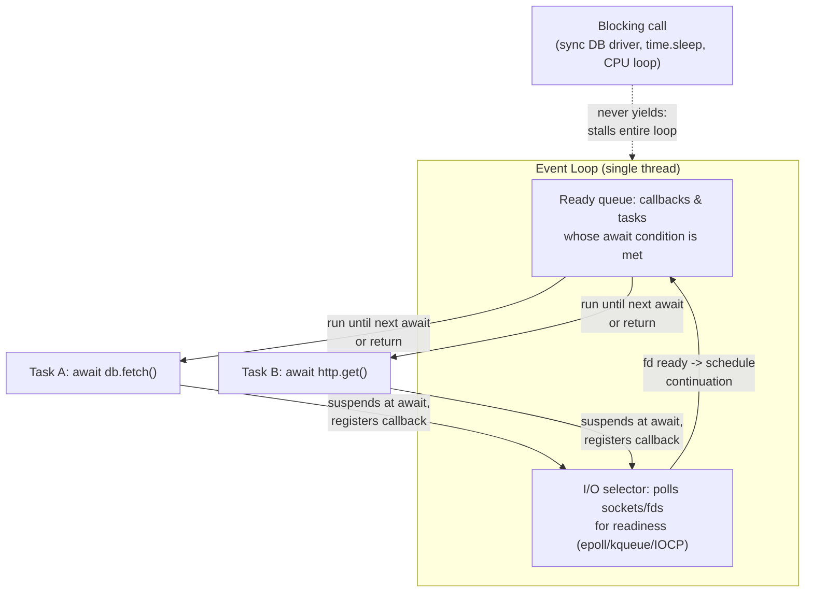

## What it is & the core abstraction

`asyncio` gives Python **cooperative concurrency on a single thread** — not parallelism.
The one abstraction that makes everything else make sense is the **event loop**: a loop
that holds a queue of callbacks and a set of coroutines, and repeatedly asks "what's ready
to make progress right now?" A coroutine only ever gives up control at an explicit
`await` point. Nothing preempts it. This is the opposite of OS-thread scheduling, where
the kernel can interrupt a thread at any instruction — here, the coroutine itself decides
when it's safe to hand control back.

That single property (voluntary yielding, never involuntary preemption) is what makes
`async` code both powerful and dangerous:

- **Powerful** — while one coroutine is waiting on I/O (a socket read, a DB round-trip, an
  HTTP call), the event loop is free to run other ready coroutines. Thousands of
  concurrent I/O-bound operations can be in flight on one thread, because none of them is
  actually consuming CPU while "waiting" — they've suspended themselves at `await` and
  registered a callback for when the result is ready.
- **Dangerous** — if a coroutine runs CPU-bound work, or calls a *blocking* (non-async)
  function, it never reaches an `await`, so it never yields. The entire event loop — and
  every other coroutine waiting on it — stalls until that one call returns.

A **coroutine** (`async def`) is a suspendable function; calling it produces a coroutine
object that does nothing until it's driven by the loop. A **Task** wraps a coroutine and
schedules it to run *now*, independently of whatever `await`s it — this is what turns
"sequential await-await-await" into actual concurrency: create the tasks first, await
them second.

```python
async def fetch(url): ...

# sequential: no concurrency, one request finishes before the next starts
for url in urls:
    await fetch(url)

# concurrent: all fetches start immediately, event loop interleaves them
async with asyncio.TaskGroup() as tg:
    tasks = [tg.create_task(fetch(url)) for url in urls]
```

`asyncio.TaskGroup` (Python 3.11+) is the modern, **structured concurrency** primitive:
every task created inside the `async with` block is guaranteed to be awaited (or
cancelled) by the time the block exits, and if any task raises, the group cancels its
siblings and re-raises as an `ExceptionGroup`. The older `asyncio.gather()` doesn't give
this guarantee — a failing task doesn't automatically cancel the others, which is an easy
source of orphaned work.

## The event loop, visually



Only one coroutine's code executes at any instant. Concurrency comes entirely from
interleaving at `await` boundaries, driven by the I/O selector reporting which
sockets/file descriptors are ready.

## Industry use cases

- **FastAPI and ASGI web frameworks** — FastAPI's whole pitch is `async def` route
  handlers that `await` downstream calls (DB, cache, other services) so one worker
  process can hold many in-flight requests concurrently instead of one thread per
  request. Production write-ups consistently converge on the same warning: the single
  most important rule with FastAPI is to never block the loop, because one blocking
  database driver call or file read on the main thread is enough to stall every other
  concurrent request on that worker.
- **Instagram's migration to asyncio** — Instagram (Django, one of the largest Python
  deployments in production) undertook a large-scale asyncio adoption to convert blocking
  I/O call sites to async, aiming to cut tail latency and free up CPU otherwise idle
  during blocking I/O waits. Their engineering write-up is notable for being candid about
  the cost side too: naive `asyncio` adoption measured roughly a 20% CPU-instruction
  overhead versus synchronous code, which they mitigated with `uvloop` (a libuv-backed
  event loop implementation) and later CPython improvements that reimplemented `Future`/
  `Task` in C.
- **Django's async views (3.1+)** — Django added `async def` view support so views can
  run on the event loop without needing a full thread per request, primarily to let
  I/O-bound views (calling external APIs, slow upstream services) scale similarly to
  Node-style servers while keeping the ORM's synchronous code path available via
  `sync_to_async` bridges for the parts that aren't async-native yet.

## Exceptions / failure modes

- **Blocking calls silently stall the whole loop** — a synchronous DB driver call,
  `time.sleep()`, or a tight CPU loop inside an `async def` doesn't raise an error; it
  just runs to completion on the one thread the loop has, freezing every other coroutine
  for that duration. There's no exception to catch — it's a design/code-review problem
  ("where could this block the loop?"), not a runtime one. The fix is either an async
  driver, or offloading via `loop.run_in_executor` / a thread pool.
- **Forgetting to `await`** — calling an `async def` function without `await` just
  creates a coroutine object and does nothing; Python emits a `RuntimeWarning:
  coroutine '...' was never awaited` but the call silently never runs.
- **Fire-and-forget tasks vanish** — `asyncio.create_task(coro())` without keeping a
  reference can be garbage-collected mid-flight, because the event loop only holds a
  *weak* reference to scheduled tasks. The task appears to start then never completes,
  with no error surfaced. The fix is to hold a reference (e.g. add it to a set) until
  it's done, or use a `TaskGroup`.
- **`gather()` doesn't cancel siblings on failure; `TaskGroup` does** — with
  `asyncio.gather()`, one task raising doesn't stop the others from running to
  completion (unless you pass `return_exceptions=False` and handle it yourself);
  `asyncio.TaskGroup` cancels remaining tasks automatically and raises an
  `ExceptionGroup`, which needs `except*` (3.11+) to unpack.
- **The GIL still exists** — asyncio is concurrency, not parallelism. It doesn't use
  multiple cores; CPU-bound work needs `multiprocessing` or a `ProcessPoolExecutor`
  regardless of how much `async`/`await` is sprinkled around it.

## Sources

- [Python docs — asyncio Event Loop](https://docs.python.org/3/library/asyncio-eventloop.html) — primary source for loop mechanics, callback scheduling, and cooperative-multitasking model.
- [Python docs — Coroutines and Tasks](https://docs.python.org/3/library/asyncio-task.html) — `TaskGroup`, `gather`, structured concurrency, and exception propagation semantics.
- [Instagram Engineering — The Journey of asyncio Adoption in Instagram](https://slideshare.net/jimmy_lai/the-journey-of-asyncio-adoption-in-instagram) — production migration story, CPU-overhead tradeoffs, `uvloop` mitigation.
- [Django docs — Asynchronous support](https://docs.djangoproject.com/en/6.0/topics/async/) — async views, `sync_to_async`/`async_to_sync` bridging.
- [Techbuddies Studio — Case Study: Fixing FastAPI Event Loop Blocking in a High-Traffic API](https://www.techbuddies.io/2026/01/10/case-study-fixing-fastapi-event-loop-blocking-in-a-high-traffic-api/) — real production incident from a blocking call stalling a FastAPI worker.
