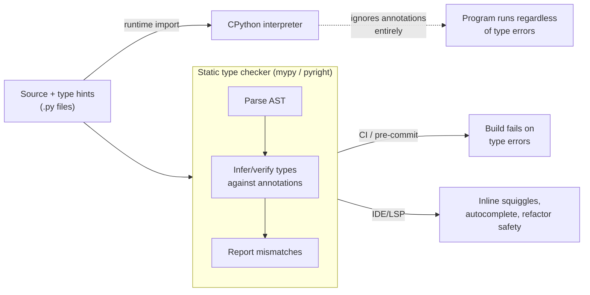

## What it is & the core abstraction

Python's `typing` module doesn't change how Python runs — the one thing to internalize
is that **the interpreter never checks a type hint**. `def f(x: int) -> str` accepts
anything at runtime; the annotation is inert metadata. All of the value comes from a
separate **static analysis** pass: a type checker (mypy, pyright) reads your source
without executing it, builds a model of every variable's declared type, and reports
where the model is inconsistent — a `str` flowing into a parameter typed `int`, a
`None` reaching code that assumes non-`None`. That split — annotations as data,
checking as a decoupled offline tool — is why type hints can be added incrementally to
an existing dynamic codebase without changing behavior.

The second core idea is **structural vs. nominal typing**. Traditional OOP typing is
nominal: a `Bucket` is only a valid `Iterable` if it explicitly subclasses `Iterable`.
Python's `typing.Protocol` instead lets a type checker accept *any* object with the
right shape — a `close()` method, a `__len__`, whatever the `Protocol` declares — with
no inheritance relationship required:

```python
from typing import Protocol

class Closable(Protocol):
    def close(self) -> None: ...

def cleanup(resource: Closable) -> None:
    resource.close()

# any object with a close() method type-checks here, no shared base class needed
```

This mirrors Python's existing duck-typing culture more closely than nominal ABCs do,
which is why `Protocol` is the idiomatic choice for "anything that can do X" interfaces.

Generics (`TypeVar`, `Generic[T]`, or the Python 3.12+ `class Container[T]:` syntax) let
a checker track a type *parameter* through a function or container, so `def first(xs:
list[T]) -> T` is verified to return the same element type it was given, for every `T`,
without writing one overload per type.

## Where the checker fits in the toolchain



The static-checker path and the runtime-execution path are completely independent — a
program with type errors still runs; a checker never touches the interpreter.

## Industry use cases

- **Dropbox's migration to type-checked Python** — Dropbox took mypy from an
  experiment to checking roughly 4 million lines of Python (about a fifth of their
  codebase annotated by 2017, expanding from there), citing that dynamic typing was
  becoming a productivity and readability bottleneck at that scale. They built
  `PyAnnotate`, a tool that observes runtime call types via profiling and auto-inserts
  annotations, to make incremental adoption tractable instead of hand-annotating
  millions of lines — and the mypy core team itself has been Dropbox-employed,
  reflecting how central the tool became to their engineering practice.
- **Pyright's adoption via VS Code / Pylance** — Microsoft's Pyright is written for
  editor-speed feedback (type errors as you type, not after a full run), and is
  reported to run meaningfully faster than mypy on large codebases, which is why it's
  the default checker behind VS Code's Pylance extension rather than a CI-only tool.
- **Pydantic's runtime layer on top of static hints** — Pydantic (and Pydantic AI, used
  heavily for structured LLM output) takes the same annotations the static checker
  reads and *also* enforces them at runtime — parsing/validating incoming data against
  the declared model and raising `ValidationError` on mismatch. This is the practical
  answer to "typing is static-only": Pydantic bridges the gap by generating a real
  validator from the type hints instead of trusting the checker alone.

## Exceptions / failure modes

- **Static-only means untrusted input still needs runtime validation** — a function
  typed `def handler(payload: dict[str, int])` will happily accept a malformed
  dict from an HTTP request body; the type checker has no visibility into runtime data.
  This is exactly the gap Pydantic-style runtime validation exists to close — type hints
  document intent, they don't sanitize input.
- **Gradual/incremental adoption on a legacy codebase produces a wall of errors** —
  running a checker on an established, previously-unannotated codebase for the first
  time routinely surfaces hundreds to thousands of errors immediately, which discourages
  adoption before it starts. The practical path used at Dropbox and elsewhere is
  strict-checking on new code while an explicit ignore/allowlist shrinks legacy debt over
  time, not an all-at-once migration.
- **Third-party stub gaps** — packages without type stubs (or with incomplete ones)
  either block full strict-mode checking or force `# type: ignore` scattered through
  otherwise well-typed code; large ecosystems (e.g. Django plugins/extensions) are
  frequently the long pole in a typing rollout.
- **mypy vs. pyright aren't drop-in equivalents** — the two checkers differ in
  strictness defaults, inference behavior on edge cases (e.g. overloads, narrowing), and
  speed (pyright is commonly several times faster on large codebases); switching tools
  can surface a fresh batch of errors even on code the other checker considered clean.
- **`Protocol` needs `@runtime_checkable` for `isinstance()`** — a plain `Protocol`
  class only exists for static analysis; using it with `isinstance()` at runtime raises
  unless it's explicitly decorated `@runtime_checkable`, and even then `isinstance`
  checks are structural (method presence), not signature-verified.

## Sources

- [Python docs — typing module](https://docs.python.org/3/library/typing.html) — primary source: runtime-vs-static distinction, `Protocol`, `Generic`/`TypeVar`.
- [Dropbox Tech — Our journey to type checking 4 million lines of Python](https://dropbox.tech/application/our-journey-to-type-checking-4-million-lines-of-python) — large-scale incremental adoption case study, `PyAnnotate` tooling.
- [Microsoft — Pyright vs mypy comparison](https://github.com/microsoft/pyright/blob/main/docs/mypy-comparison.md) — checker differences in strictness, speed, inference.
- [Pydantic AI docs](https://ai.pydantic.dev/) — runtime validation built on typing, used for structured LLM output.
