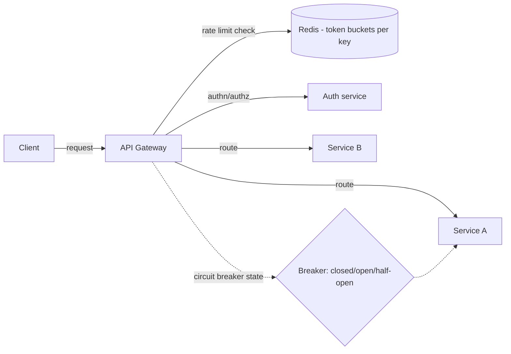

## What it is & the core abstraction

An API gateway is the single front door a set of backend services shares — but the
useful mental model isn't "reverse proxy," it's **a boundary that owns cross-cutting
concerns so individual services don't each reinvent them**: authentication, routing,
request aggregation, and — the focus here — protecting everything behind it from too
much traffic, whether that traffic is malicious, accidental, or just a legitimate
success disaster.

What a gateway should own: routing/aggregation, authn/authz enforcement, rate limiting,
and edge-level observability. What it should **not** own: business logic. A gateway
that starts making domain decisions becomes a second copy of the service it's meant to
be decoupling from.

Rate limiting and circuit breaking solve two different problems that get confused
constantly:

- **Rate limiting** protects a backend from a *client* sending too much traffic —
  it's about fairness and abuse prevention, enforced per key (API key, user, IP).
- **Circuit breaking** protects a *caller* from a backend that's already unhealthy —
  it's about failing fast instead of piling up retries against something that isn't
  going to answer.

## Architecture diagram

Rate limiting belongs at the edge, before a request reaches any service — throttling
inside each service individually means the expensive routing/auth work already
happened for a request you're about to reject anyway.

## Rate-limiting algorithms

- **Token bucket** — a bucket holds up to N tokens, refilled at a fixed rate; each
  request consumes one token, and an empty bucket rejects the request. Allows
  legitimate short bursts up to bucket capacity while still enforcing an average rate
  over time — this is why it's the industry default (Stripe and AWS API Gateway both
  use it).
- **Leaky bucket** — requests queue and drain at a fixed output rate regardless of
  input burstiness; smooths traffic into a uniform rate rather than allowing bursts,
  at the cost of added latency for queued requests.
- **Sliding window (log or counter)** — tracks request timestamps (log) or bucketed
  counts (counter) over a moving window rather than a fixed one, avoiding the classic
  fixed-window edge case where 2x the intended rate slips through right at a window
  boundary. Sliding window counter trades a little precision for much lower memory use
  than a full sliding window log.

## Circuit breakers & bulkheads for backpressure

- **Circuit breaker** — wraps a dependency; after enough consecutive failures it
  "opens" and fails fast (no call attempted) for a cooldown period, then "half-opens" to
  test with a trickle of traffic before fully closing again. Netflix's Zuul wraps every
  Ribbon-routed call in a Hystrix command specifically for this — one failing backend
  shouldn't exhaust Zuul's own thread pool retrying it.
- **Bulkheads** — partition resources (thread pools, connection pools) per downstream
  dependency so one slow/failing dependency can't starve the resources every other
  dependency also needs. Named for ship compartmentalization for the same reason: contain
  the flood, don't let it sink everything.

## Industry use cases

- **Stripe** — runs multiple limiter tiers in production (rate limiters and load
  shedders): a per-second request cap per user with brief burst allowance for
  legitimate spikes, plus a concurrent-in-flight-request cap to protect CPU-intensive
  endpoints specifically. Implemented with the token bucket algorithm backed by Redis
  for low-latency, shared state across gateway instances — because payments
  infrastructure has to stay available regardless of what any single customer's traffic
  does.
- **AWS API Gateway** — throttles using token bucket semantics with a documented
  default of 10,000 requests/sec steady-state and a 5,000-request burst capacity per
  account per region; once both are exceeded, callers get `429 Too Many Requests`. This
  is a concrete, publicly documented instance of the algorithm described above running
  at hyperscale.
- **Netflix Zuul + Hystrix** — every route Zuul proxies through Ribbon's load balancer
  is wrapped in a Hystrix circuit-breaker command, giving the whole edge tier a uniform
  fail-fast behavior and a place to define fallback responses when a backend is
  unavailable, instead of leaving that decision to each service.

## Exceptions / failure modes

- **Thundering herd on breaker half-open** — when a circuit breaker transitions from
  open to half-open, if every caller simultaneously sends its next retry at once, the
  trickle of "test" traffic is actually a burst that can re-trip the breaker
  immediately. Jittered backoff on the caller side, or a single canary request rather
  than all callers probing at once, avoids this.
- **Noisy-neighbor without bulkheads** — a rate limiter that only caps requests/sec
  doesn't protect against one tenant's slow requests exhausting a shared connection
  pool or thread pool; without per-dependency bulkheads, a rate-limited-but-still-slow
  client can still starve resources needed by everyone else behind the same gateway.
- **Fixed-window boundary bursts** — naive fixed-window counters allow roughly double
  the intended rate right at a window boundary (a burst at the end of window N,
  another at the start of N+1); sliding window algorithms exist specifically to close
  this gap.
- **Distributed counter drift** — rate limiting across multiple gateway instances
  needs shared state (typically Redis); if that shared store is itself under load or
  partitioned, limiter accuracy degrades exactly when you need it most — the limiter's
  own dependency becomes a single point of failure unless it's deployed for the same
  availability bar as the thing it protects.

## When NOT to reach for a dedicated gateway / rate limiter

- **A single service or a monolith with no fan-out** — there's no cross-cutting
  concern to centralize yet; a gateway in front of one service just adds a network hop
  and an operational dependency for no architectural benefit.
- **Trusted, low-volume internal traffic with no abuse surface** — rate limiting exists
  to bound worst-case behavior from untrusted or high-cardinality callers; applying
  the same machinery to a handful of known internal callers is solving a problem that
  doesn't exist yet, at the cost of real operational complexity (shared Redis state,
  tuning thresholds, alerting on 429s).

## Sources

- [Stripe — Scaling your API with rate limiters](https://stripe.com/blog/rate-limiters) — primary source for Stripe's multi-tier limiter design and token-bucket-over-Redis implementation.
- [AWS — Throttle requests to your REST APIs](https://docs.aws.amazon.com/apigateway/latest/developerguide/api-gateway-request-throttling.html) — documented token-bucket throttling defaults and behavior at hyperscale.
- [Apache APISIX — API Gateway Rate Limiting](https://apisix.apache.org/learning-center/api-gateway-rate-limiting/) — algorithm and gateway-placement overview.
- [Sujeet Jaiswal — Rate Limiting Strategies](https://sujeet.pro/articles/rate-limiting-strategies) — token bucket vs. leaky bucket vs. sliding window tradeoffs.
- [Netflix/Zuul — Core Features](https://github.com/Netflix/zuul/wiki/Core-Features) — Hystrix circuit-breaker integration at the edge-gateway layer.
