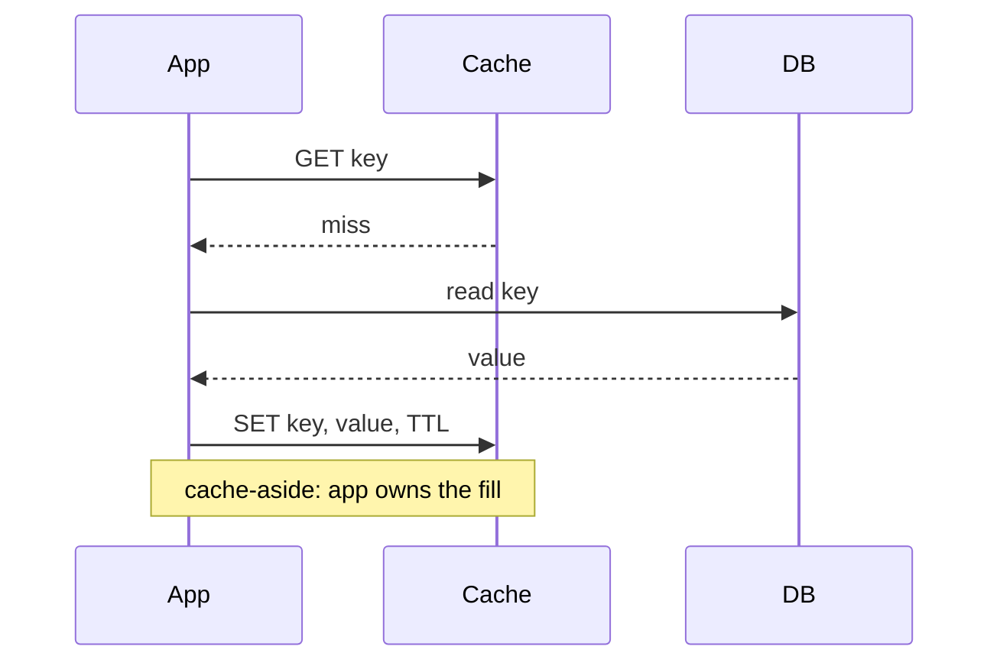
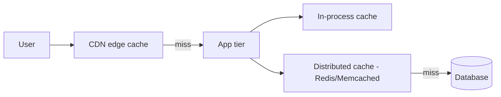

## What it is & the core abstraction

Caching is trading **staleness risk for latency and load reduction** — every caching
decision is really a decision about how much staleness you can tolerate and who's
responsible for keeping the cache honest. The strategies below differ in exactly one
axis: **who writes to the cache, and when relative to the write to the source of
truth.**

- **Cache-aside (lazy loading)** — the application checks the cache first; on a miss,
  it reads from the database and populates the cache itself. The cache is a
  demand-filled, look-aside store — nothing is in it that hasn't been explicitly
  requested at least once. This is the Facebook Memcache model: the cache never talks
  to the database directly.
- **Write-through** — every write goes to the cache and the database together
  (synchronously), so the cache is never stale for anything that's been written since
  it was warm. Costs write latency; pays it back as read consistency.
- **Write-behind (write-back)** — writes land in the cache immediately and are flushed
  to the database asynchronously, batched or debounced. Fast writes, but a cache crash
  before flush loses data — you've moved the durability boundary.
- **Refresh-ahead** — the cache proactively re-fetches an entry before it expires
  (when read frequency crosses a threshold), so hot keys never actually miss; the
  tradeoff is wasted refreshes for keys that stop being hot right after a refresh.

## Architecture diagram

Where each cache tier sits relative to the request path:

CDN edge caching sits closest to the user (static assets, cacheable API responses);
the distributed cache (Redis/Memcached/EVCache) sits in front of the database for
app-tier reads; a local in-process cache is the fastest but least consistent tier,
useful only for data that's cheap to be wrong about briefly.

## Invalidation: the actually-hard part

Populating a cache is easy; knowing when an entry is wrong is the whole problem.

- **TTL-based** — simplest, bounds staleness to a fixed window, but every entry with
  the same TTL set at the same time expires together — the seed of a stampede.
- **Event-driven invalidation** — a write to the source of truth publishes an
  invalidation (or refresh) event via pub/sub, so the cache is corrected the moment the
  underlying data changes rather than waiting out a TTL. Tighter consistency, more
  moving parts (a message bus, ordering guarantees).
- **Versioned keys** — encode a version or content-hash into the cache key itself
  (`user:42:v7`); a write "invalidates" simply by writing under a new key, and old
  versions expire naturally. Sidesteps race conditions in explicit delete/invalidate
  calls, at the cost of extra cache memory for the versions in flight.

## Industry use cases

- **Facebook Memcache** — a demand-filled, look-aside cache layered in front of MySQL,
  scaled across three deployment tiers described in their NSDI '13 paper: a single
  cluster (read-heavy, wide fan-out), multiple front-end clusters (replication across
  clusters), and clusters spread globally (consistency for a worldwide user base) —
  handling trillions of items and billions of requests per second at the scale
  described.
- **Netflix EVCache** — a Memcached-based distributed cache purpose-built for
  cross-region replication and resilience: roughly 200 clusters and 22,000 server
  instances, replicating around 30 million events globally and serving on the order of
  400 million operations per second, with linear scalability by adding replica copies.
- **CDN edge caching (general pattern)** — pushes cache-aside semantics to the network
  edge for static/cacheable content, cutting origin load and latency simultaneously;
  every major CDN vendor's edge tier is functionally a globally-distributed cache-aside
  layer with TTL- and header-driven (`Cache-Control`, `ETag`) invalidation.

## Exceptions / failure modes

- **Cache stampede / thundering herd** — when a hot key expires (or a cluster
  restarts cold), every concurrent request misses at once and all fan out to the
  database for the same row simultaneously; Facebook's own numbers show a single
  mistimed key expiration spiking database query load from roughly 1,300 to 17,000
  queries/sec. Mitigations: request coalescing / single-flight locking (only one
  request repopulates, others wait on it), staggered TTLs with jitter so entries don't
  expire in lockstep, and background/refresh-ahead for known-hot keys.
- **Stale-read windows** — cache-aside and TTL-based invalidation both have an
  inherent window where the cache can serve data the source of truth has already
  changed; this is fine for eventually-consistent reads (a product listing) and
  unacceptable for others (an account balance) — the strategy has to match the read's
  actual consistency requirement, not be picked by default.
- **Hot-key contention** — a single extremely popular key (a viral post, a flash-sale
  SKU) can overwhelm the one cache node/partition that owns it even though the cluster
  overall has capacity; mitigated by key-level replication/sharding of hot keys
  specifically, not by adding more nodes generically.
- **Write-behind data loss** — if the cache process crashes before an async flush
  completes, writes acknowledged to the client are gone; this makes write-behind a poor
  fit for data where "acknowledged" must mean "durable."

## When NOT to reach for caching

- **Write-heavy workloads with poor read-hit ratios** — if most values are read once
  or never re-read before they change, the cache-maintenance cost (invalidation
  correctness, extra infrastructure) exceeds any latency win; you're paying complexity
  for a low hit rate.
- **Data with a strict consistency requirement** — anywhere "read your own write" or
  cross-replica consistency is a correctness requirement (financial balances,
  inventory counts at the moment of purchase), caching introduces exactly the staleness
  window the requirement forbids; go to the source of truth, or use a strategy
  (write-through, versioned reads) that explicitly closes that window rather than
  bolting a cache-aside layer on top and hoping.

## Sources

- [USENIX — Scaling Memcache at Facebook](https://www.usenix.org/conference/nsdi13/technical-sessions/presentation/nishtala) — primary source for the demand-filled look-aside model and three-tier deployment scale.
- [Netflix/EVCache — wiki](https://github.com/Netflix/EVCache/wiki) — architecture and scale numbers for Netflix's distributed cache.
- [Redis — How to tame the thundering herd problem](https://redis.io/blog/how-to-tame-the-thundering-herd-problem/) — event-driven invalidation and stampede mitigation patterns.
- [Levelop — Cache Invalidation Strategies in System Design](https://levelop.dev/blog/cache-aside-write-through-write-behind-read-through-four-strategies-four-failure) — the four core strategies and their failure modes.
- [Levelop — 4 Caching Strategies for System Design](https://levelop.dev/blog/caching-strategies-system-design-four-patterns-failure-modes) — patterns cross-referenced against real failure scenarios.
