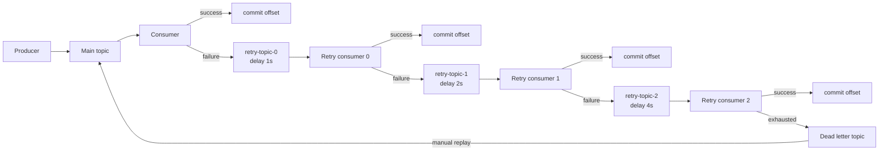

## What it is & the core abstraction

Kafka has no built-in dead-letter queue. Unlike SQS — where a redrive policy and
`maxReceiveCount` are infrastructure-layer settings on the queue itself — a Kafka DLQ is
just an ordinary topic that a consumer application chooses to publish to when it gives up
on a record. The pattern, not the primitive, is what "DLQ" means in Kafka: consumer code
decides what "failed" means, decides how many times to retry, and decides where the
record goes next. Kafka Connect is the one place DLQ support ships out of the box
(`errors.tolerance=all` + `errors.deadletterqueue.topic.name`); everywhere else, you're
building it yourself or using a framework recoverer (Spring Kafka's
`DeadLetterPublishingRecoverer`) that does it for you.

The problem a DLQ solves is specific: a Kafka consumer only commits an offset after it
successfully processes (or explicitly gives up on) a record. If a consumer keeps retrying
a failing record in a blocking loop, it never advances its offset — every other record
behind it in that partition is stuck too, even ones that would have processed fine. A
**poison pill** is the extreme case: a message that can *never* succeed (malformed
payload, a schema the consumer can't deserialize, a business-rule violation) — retrying it
forever doesn't just waste time, it wedges the partition permanently.

The standard fix is **non-blocking retry via retry topics**: instead of retrying in place,
the consumer republishes the failed record to a separate `-retry-N` topic with a backoff
delay, immediately commits its own offset, and moves on. A separate consumer group reads
each retry topic, waits out its delay, and reattempts. After the last retry level is
exhausted, the record is published to the DLQ topic for good — a human or a
reprocessing job, not the hot path, decides what happens to it next.

## Architecture diagram

Each retry level is its own topic with its own consumer group, so a slow or failing retry
never blocks the main topic's throughput — the "leaky bucket" of retries drains
independently, and only records that survive every level land in the DLQ.

## Industry use cases

- **Uber (Insurance Engineering / Driver Injury Protection)** — Uber built count-based
  retry topics plus a DLQ specifically because "repeatedly failed messages can clog batch
  processing": a Kafka consumer won't commit an offset until it succeeds, so a stuck
  record blocks every message behind it. Their retry topics enforce increasing delays
  ("leaky bucket pattern") per level, and a custom command-line tool backed by its own
  offset-tracking consumer replays DLQ messages by republishing them into the first retry
  topic. They explicitly call out that consumers must tolerate out-of-order delivery and
  be idempotent, since Kafka's ordering guarantee is per-partition only, and retry topics
  break the original partition assignment.
- **Spring Kafka ecosystem (`@RetryableTopic` / `DeadLetterPublishingRecoverer`)** — Spring
  Kafka's non-blocking retry support names retry topics per attempt (e.g.
  `orders-myConsumerGroup1-retry-0`) and uses exponential backoff (e.g. 1s, 2s, 4s across
  successive levels). Critically, it pauses partition consumption "without committing the
  offset" rather than sleeping the consumer thread — sleeping risks Kafka deciding the
  consumer is dead (missed heartbeat) and triggering a partition reassignment mid-retry.
  After a configured attempt count, the record routes to the DLT for manual intervention.
- **Kafka Connect (Confluent)** — Since Kafka 2.0, Connect has first-class DLQ support:
  `errors.tolerance=all` plus `errors.deadletterqueue.topic.name` routes records a sink
  connector can't process to a DLQ topic, with headers describing why the record failed
  (exception class, message, stack trace). This is the one place in the Kafka ecosystem
  where DLQ is a configuration knob instead of application code you write yourself.

## Exceptions / failure modes

- **Poison-pill loops without a DLQ** — a consumer that blindly retries forever on a
  message it can never process wedges the partition: every later message queues up behind
  it, and consumer lag climbs unbounded. This is the core failure mode the retry-topic +
  DLQ pattern above exists to prevent.
- **The DLQ becomes a silent black hole** — the easy mistake is building the DLQ producer
  side and never building the consumer/replay side. Messages accumulate, nobody looks,
  and by the time someone notices there's an incident, the retention window may have
  already expired the evidence. Uber's fix was a dedicated CLI tool for inspecting and
  replaying DLQ messages — treat replay tooling as part of the DLQ, not an afterthought.
- **Ordering loss across retry topics** — moving a failed record to a retry topic (a
  different topic, likely a different partition) breaks the original partition's ordering
  guarantee for that key. Any consumer relying on retry topics must tolerate
  out-of-order delivery and be idempotent — this is a design requirement, not an edge
  case, per Uber's own writeup.
- **Retry-topic proliferation without visibility** — each retry level is its own topic
  and consumer group; without monitoring per-level lag and DLQ arrival rate, you lose the
  signal that something is systematically failing (a bad deploy, a downstream outage)
  versus one-off poison pills.
- **DLQ retention shorter than useful** — same trap as any Kafka topic: if the DLQ's
  retention window is shorter than the time it takes someone to notice and act, the
  evidence needed to diagnose the failure is gone before anyone looks.

## When NOT to use this

- **Simple, low-volume pipelines where a failed message can just be logged and dropped**
  — building retry topics, DLQ consumers, and replay tooling is real operational surface
  area; if failures are rare and low-stakes, a dead-simple try/catch-and-log may be enough.
- **Systems already on SQS or another managed queue** — SQS gives you DLQ + redrive
  policy + `maxReceiveCount` as a configuration setting, with no retry-topic
  infrastructure to build; don't reimplement Kafka's DIY pattern if the managed primitive
  already covers the need.
- **Strict ordering requirements you can't relax** — if a consumer absolutely cannot
  tolerate out-of-order delivery (e.g. sequential state-machine transitions on a single
  entity), routing failures through retry topics breaks that guarantee; a blocking retry
  with a circuit breaker (accepting reduced throughput) may be the safer tradeoff than a
  DLQ that reorders.

## Sources

- [Confluent — Apache Kafka Dead Letter Queue: A Comprehensive Guide](https://www.confluent.io/learn/kafka-dead-letter-queue/) — DLQ concept, Kafka's lack of native support outside Connect, and diagnose/reprocess/discard workflow.
- [Eugene Khyst — Spring Kafka Non-Blocking Retries and Dead Letter Topics](https://github.com/eugene-khyst/spring-kafka-non-blocking-retries-and-dlt) — retry-topic naming, exponential backoff, `@RetryableTopic`/`DeadLetterPublishingRecoverer` mechanics, and the pause-without-commit detail.
- [AWS — Using dead-letter queues in Amazon SQS](https://docs.aws.amazon.com/AWSSimpleQueueService/latest/SQSDeveloperGuide/sqs-dead-letter-queues.html) — the managed-queue contrast: redrive policy, `maxReceiveCount`, retention-period gotcha.
- [Uber Engineering — Building Reliable Reprocessing and Dead Letter Queues with Kafka](https://www.uber.com/en-IE/blog/reliable-reprocessing/) — production case study: count-based retry topics, leaky-bucket delays, replay tooling, ordering/idempotency requirements.
