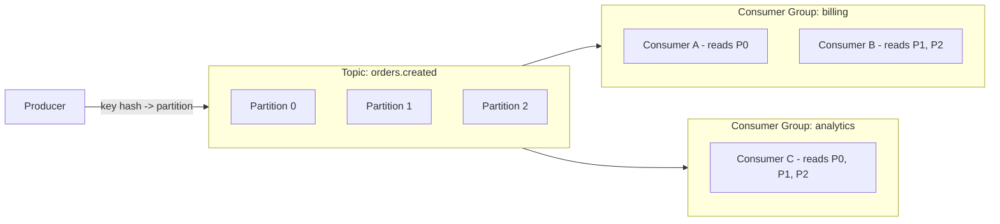
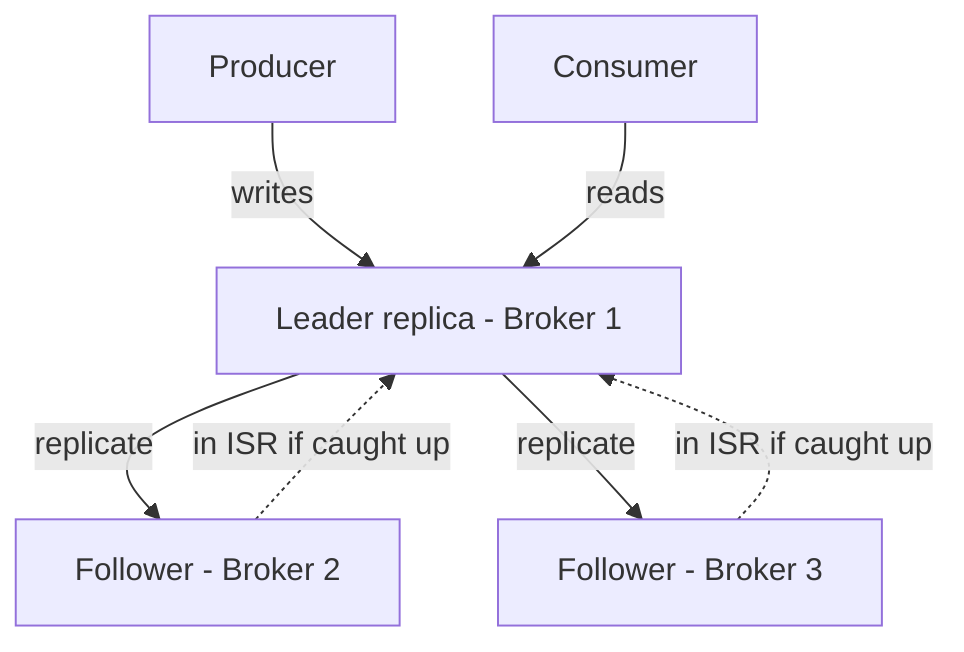

## What it is & the core abstraction

Kafka is a distributed **commit log**, not a message queue. That distinction is the whole
design. A queue deletes a message once it's consumed; a log retains an ordered, immutable
sequence of records for a configured retention window (time or size-based), and consumers
each track their own read position (**offset**) into it. That single choice is what makes
Kafka able to serve many independent consumers replaying the same stream at different
speeds, instead of one consumer draining a queue.

The core abstractions:

- **Topic** — a named stream of records (e.g. `orders.created`).
- **Partition** — a topic is split into ordered, independently-appended partitions. Order
  is only guaranteed *within* a partition, not across a topic — this is the throughput
  lever: more partitions = more parallelism, at the cost of losing cross-partition order.
- **Offset** — a per-partition, monotonically increasing position. A consumer's progress
  is "offset N in partition P," not "message deleted."
- **Broker** — a Kafka server; a cluster is many brokers, each owning some partitions.
- **Consumer group** — a set of consumers that split a topic's partitions between them so
  each partition is read by exactly one consumer in the group at a time.

## Architecture diagram

Each partition is replicated across multiple brokers for fault tolerance:

Only the **leader** serves reads and writes for a partition; followers replicate it. The
**In-Sync Replica (ISR)** set is the subset of followers caught up enough to be eligible
for leader election if the current leader fails. With `f+1` replicas, a partition
tolerates `f` broker failures without losing committed data — but only if a write was
acknowledged by enough of the ISR first (`acks=all`).

## Industry use cases

- **Event sourcing / durable commit log** — Kafka retains an ordered history of every
  state change, so downstream systems can replay it to rebuild state or backfill a new
  consumer. This decouples producers from consumers entirely: a producer never needs to
  know who's reading, or how many readers there are.
- **Log aggregation at LinkedIn** — Kafka was built at LinkedIn originally to consolidate
  real-time log/event feeds from many services into one pipeline for monitoring and
  analytics, and scaled from there to handling over a million messages/sec, trillions of
  messages/day, across the company.
- **Real-time stream processing at Uber and Netflix** — Uber runs Kafka (paired with
  Flink) as the backbone for pricing, fraud detection, and trip monitoring, where
  low-latency, ordered, replayable event streams are the requirement. Netflix uses Kafka
  as the eventing/messaging backbone across studio and product domains, as a shared
  multi-tenant platform rather than a per-team message bus.

## Exceptions / failure modes

- **Consumer-group rebalance storms** — when group membership changes (a consumer joins,
  leaves, or is considered dead by a missed heartbeat), Kafka reassigns partitions across
  the group. If consumers churn frequently (slow processing triggering session timeouts,
  autoscaling flapping), this can cascade into repeated rebalances where no consumer makes
  steady progress. Mitigate with cooperative/incremental rebalancing and tuned session/
  heartbeat timeouts.
- **Partition skew under a hot key** — if a producer partitions by key (e.g. `user_id`)
  and one key is disproportionately active, that partition becomes a hot spot: one
  consumer in the group does most of the work while others idle. There's no free fix —
  it's a partitioning-key design decision made up front.
- **Exactly-once is scoped, not global** — the idempotent producer (`enable.idempotence=
  true`) only guarantees no duplicate writes *within the lifetime of one producer
  instance*; it does not survive a producer restart. Full exactly-once processing needs
  transactional producers plus `isolation.level=read_committed` on the consumer — and
  even then, "exactly once" means exactly-once *within Kafka*, not automatically
  exactly-once in whatever external system the consumer writes to next.
- **Retention vs. replay is a tradeoff, not a default you can ignore** — a short retention
  window means a new or recovering consumer can't replay far enough back to rebuild
  state; a long one costs storage (mitigated at scale by tiered storage, moving cold
  segments to object storage, as Uber and others do).

## When NOT to reach for Kafka

- **A simple task queue (one producer, one consumer, fire-and-forget work items)** — a
  managed queue (SQS, RabbitMQ) is simpler to operate and matches the actual semantics
  needed; Kafka's partition/consumer-group model is solving a problem you don't have.
- **Low-throughput pub/sub between a handful of services** — the operational overhead of
  running or paying for a Kafka cluster (or Confluent Cloud) isn't justified if a managed
  pub/sub service (or even a database outbox pattern) covers the actual message volume.

## Sources

- [Confluent — Kafka Replication (design docs)](https://docs.confluent.io/kafka/design/replication.html) — primary source for leader/ISR/replication mechanics.
- [Confluent — Data Replication Protocol (course)](https://developer.confluent.io/courses/architecture/data-replication/) — deeper walkthrough of the replication protocol.
- [Confluent — What Is Apache Kafka? Architecture, Use Cases](https://www.confluent.io/what-is-apache-kafka/) — vendor overview, good for the use-case framing.
- [Conduktor — Kafka Topics, Partitions, and Brokers](https://www.conduktor.io/glossary/kafka-topics-partitions-brokers-core-architecture) — clear core-architecture explainer.
- [Anil Goyal — Exactly-Once Semantics: Producer & Consumer Idempotency](https://medium.com/@anil.goyal0057/achieving-exactly-once-semantics-in-kafka-producer-consumer-idempotency-abad50cba95c) — practical caveats on EOS scope.
