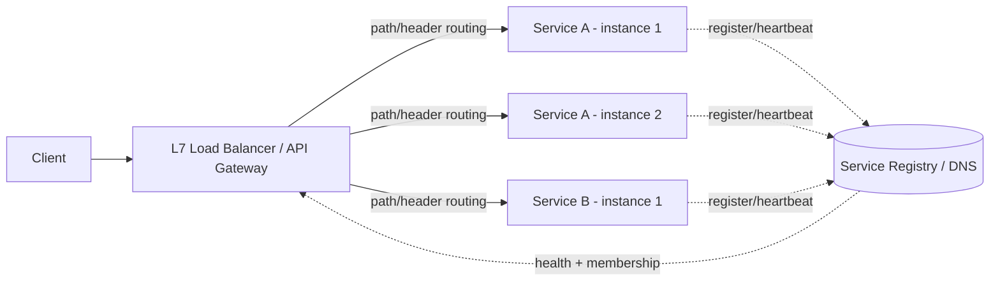
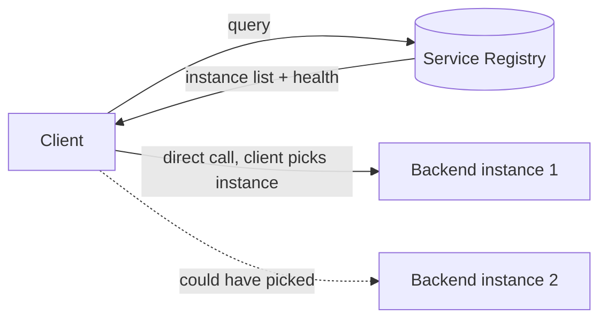

## What it is & the core abstraction

A load balancer's job sounds simple — spread requests across backends — but the whole
design space collapses into one question: **at which layer do you decide, and how much
do you know about the request when you decide it?** That's the L4-vs-L7 split, and it
determines everything else: what algorithms are available, what a "health check" even
means, and how service discovery has to feed it.

- **L4 (transport layer)** — balances TCP/UDP connections based on IP + port. Fast
  (no payload inspection), protocol-agnostic, but blind to HTTP semantics (can't route
  on path, header, or content-type).
- **L7 (application layer)** — terminates HTTP, reads the request, then routes on path,
  header, cookie, or gRPC method. More expensive per-request, but this is what makes
  path-based microservice routing, canary releases, and content-based routing possible.

**Service discovery** is the other half: a load balancer only has algorithms to run
*against something* — a live, correct set of backend instances. Two models:

- **Server-side discovery** — a dedicated registry (DNS, or a system like Netflix
  Eureka) tracks live instances; a load balancer (or gateway) queries it and routes.
  The client only ever talks to one stable address.
- **Client-side discovery** — the client (or a client-side library, e.g. Netflix
  Ribbon, or a sidecar proxy like Envoy in a service mesh) queries the registry itself
  and picks a backend directly, skipping a centralized LB hop entirely.

## Architecture diagram

Client-side discovery removes the centralized hop — each caller (or its sidecar) picks
a backend directly:

## Algorithms & why consistent hashing matters

- **Round robin / weighted round robin** — simplest, ignores actual backend load;
  weighted variants account for heterogeneous instance capacity.
- **Least connections / least response time** — routes to the backend with the fewest
  in-flight requests or lowest observed latency; adapts to load skew that round robin
  can't see.
- **Power of two choices** — sample two random backends, pick the less-loaded one;
  near-optimal load spreading at a fraction of the coordination cost of tracking global
  least-connections state.
- **Consistent hashing** — maps both backends and request keys onto a hash ring; a
  request is routed to the nearest backend clockwise on the ring. The payoff isn't
  algorithmic elegance, it's **minimal remapping**: adding or removing one backend only
  reshuffles the keys adjacent to it on the ring, not the whole keyspace. This is what
  makes cache-affinity and shard-affinity routing survive backend churn — without it,
  every scale-up/down event would invalidate most of a downstream cache.

Google's **Maglev** is the reference implementation of consistent hashing done
purely in software: no specialized hardware, connection-level consistent hashing so an
in-flight TCP connection keeps landing on the same backend even as the backend pool
changes, and a single Maglev instance saturating a 10 Gbps link.

## Industry use cases

- **Google Maglev** — Google's edge network load balancer since 2008, running on
  commodity Linux servers rather than specialized hardware appliances; scales
  horizontally by adding machines and uses consistent hashing plus connection tracking
  specifically to survive backend and Maglev-instance failures without breaking
  in-flight connections.
- **Netflix OSS stack (Eureka + Ribbon + Zuul)** — Eureka is the service registry;
  Ribbon is the client-side load balancer that queries it; Zuul is the L7 edge gateway
  that, by default, load-balances via Ribbon's zone-aware round robin across whatever
  instances Eureka reports healthy. This is the canonical server-registry +
  client-side-picks architecture.
- **Envoy at Lyft** — built originally at Lyft as a single high-performance proxy, then
  generalized into the "universal data plane" for service-mesh architectures (Istio
  uses Envoy as its default sidecar). Envoy pushed L7-aware load balancing,
  active+passive health checking, and consistent-hashing load balancing into a
  sidecar every service gets for free, rather than a single centralized tier.

## Exceptions / failure modes

- **Thundering herd on failover** — when a backend (or an entire zone) is marked
  unhealthy, every load balancer instance simultaneously redirects its traffic to the
  remaining backends, which can overload them hard enough to cascade the failure
  outward. Mitigate with gradual/slow-start reintroduction and outlier detection that
  ejects unhealthy backends probabilistically, not as a hard cliff.
- **Sticky sessions vs. statelessness** — session affinity (routing a client
  consistently to the same backend, often via cookie) breaks the "any backend can serve
  any request" assumption that makes scaling and failover trivial. It's often a symptom
  of state that should have moved to a shared store (Redis, a database) instead of
  living in-process.
- **Health-check flapping** — a backend that's borderline (GC pause, transient CPU
  spike) can bounce between healthy/unhealthy repeatedly, causing repeated
  redistribution of its share of traffic. Passive health checks (derived from real
  request outcomes) combined with hysteresis (require N consecutive failures/successes
  before flipping state) reduce this compared to a single active probe.
- **Stale registry data** — client-side discovery with a caching client means a backend
  that just died can still receive traffic until the client's local view catches up;
  this is a real availability-vs-consistency tradeoff in the registry itself, not a bug
  to "fix" away.

## When NOT to reach for a dedicated load balancer / service discovery layer

- **A single backend instance, or an internal low-QPS service** — there's nothing to
  balance across; a load balancer here is pure operational overhead (another thing to
  deploy, monitor, and fail) for zero benefit.
- **A monolith calling itself in-process** — service discovery solves "which of N
  running instances of service X do I call," a question that doesn't exist inside a
  single process boundary.

## Sources

- [Google — Maglev: A Fast and Reliable Software Network Load Balancer](https://research.google/pubs/maglev-a-fast-and-reliable-software-network-load-balancer/) — primary source for consistent-hashing LB design, connection tracking, and scale numbers.
- [Envoy Proxy — home](https://www.envoyproxy.io/) — origin story (Lyft) and L7/service-mesh proxy design.
- [GeeksforGeeks — Consistent Hashing](https://www.geeksforgeeks.org/system-design/consistent-hashing/) — clear walkthrough of the hash-ring mechanism and minimal-remapping property.
- [Netflix/Zuul — Core Features](https://github.com/Netflix/zuul/wiki/Core-Features) — how Zuul integrates with Eureka (discovery) and Ribbon (client-side LB).
- [Splunk — Load Balancing in Microservices](https://www.splunk.com/en_us/blog/learn/microservices-load-balancing.html) — algorithm survey and L7/service-discovery integration overview.
